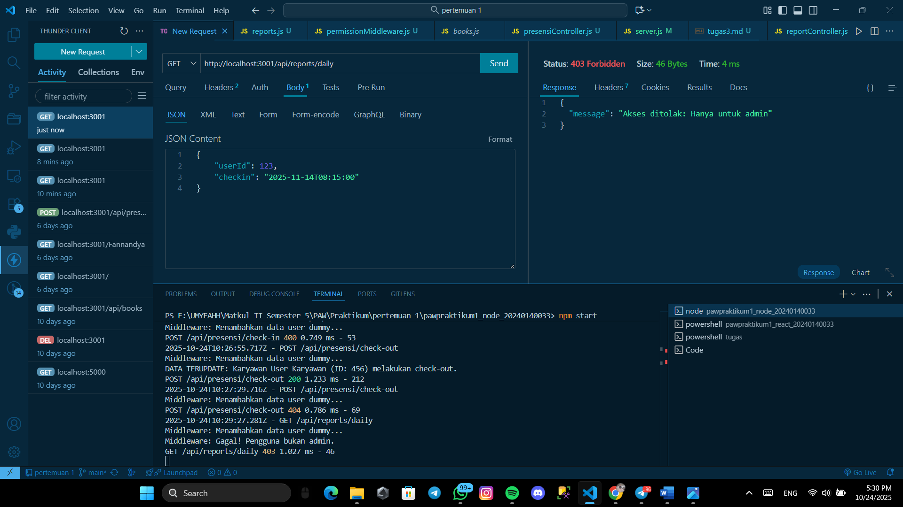

# Tugas 2
 Menampilkan End Point presensi/check-in
 

 Menampilkan End Point presensi/check-in jika dilakukan lebih dari 1 kali
 

 Menampilkan End Point presensi/check-out
 

 Menampilkan End Point presensi/check-out jika belum melakukan check-in
 

 Menampilkan End Point reports/daily
 

  Menampilkan End Point reports/daily gagal karena masalah role yang ada
 

