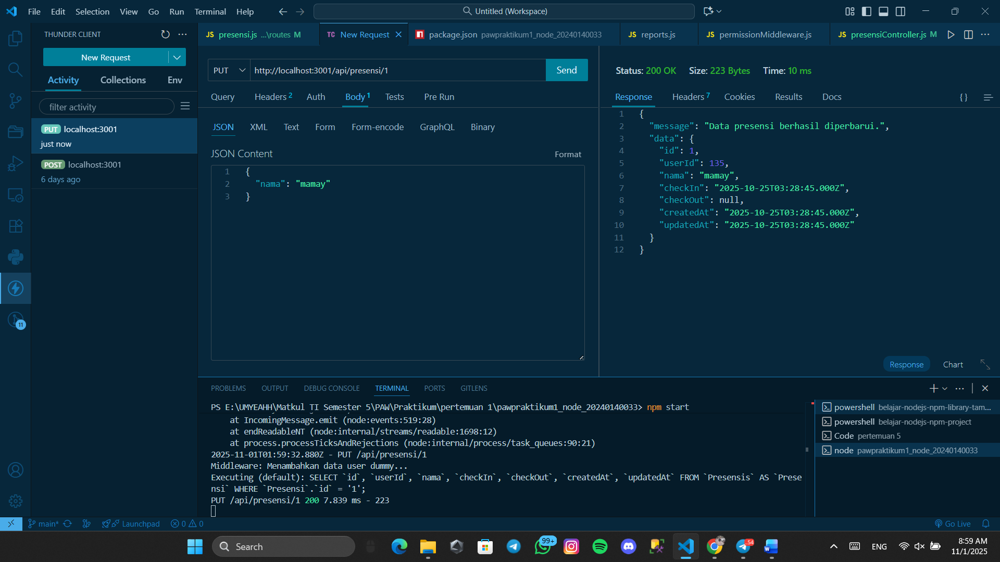
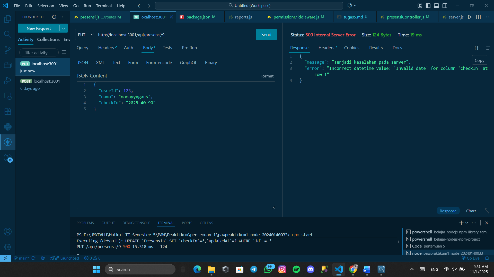
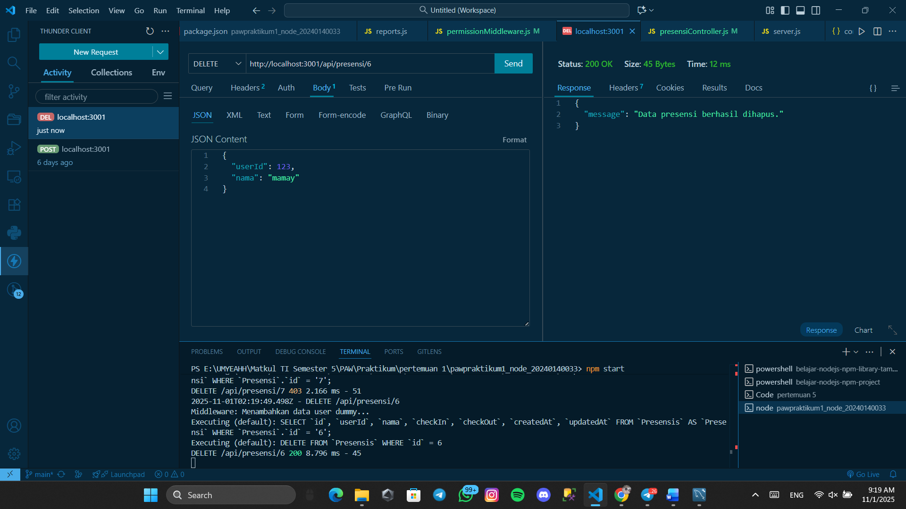
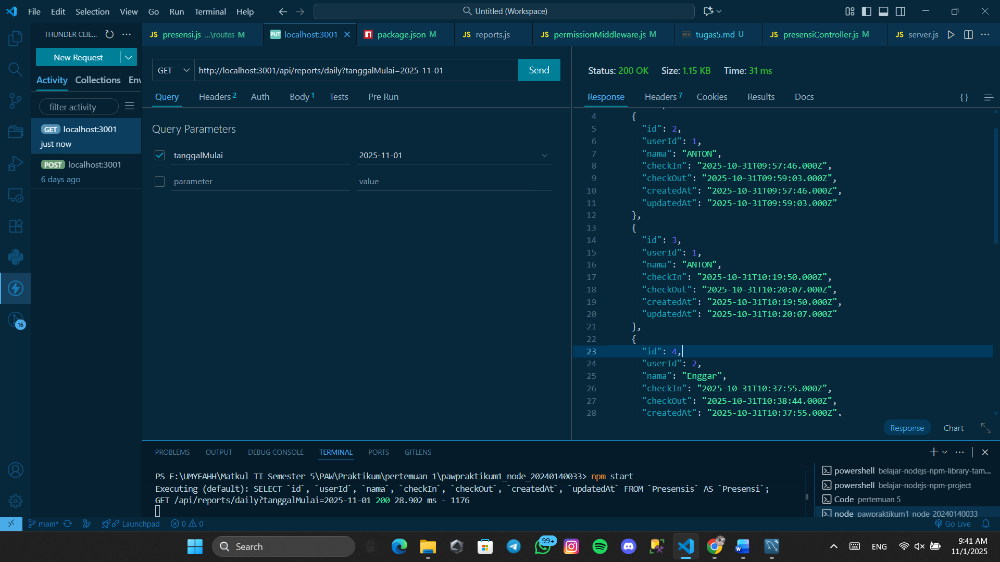

# Tugas 5

Menampilkan End Point update data presensi

Menampilkan End Point update jika format tanggal yang diisi tidak valid

Menampilkan End Point delete data

Menampilkan endpoint search berdasarkan nama

menampilkan endpoint search berdasarkan tanggal

