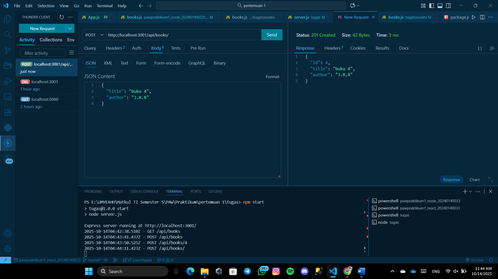
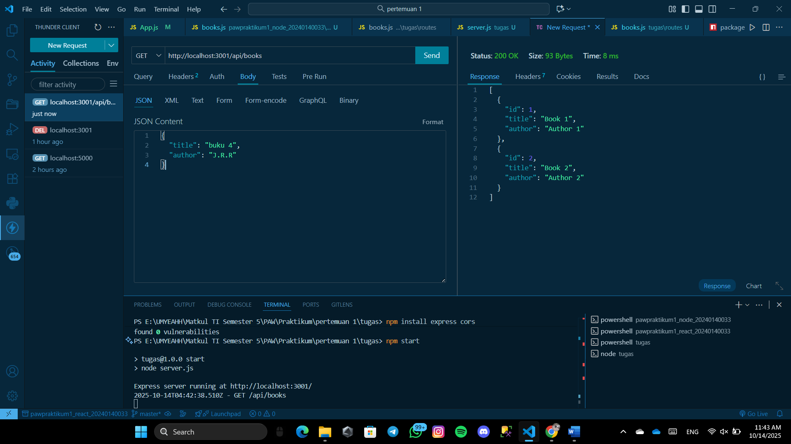
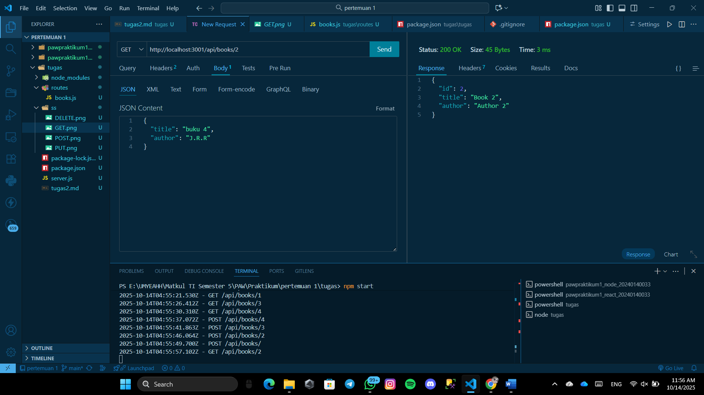
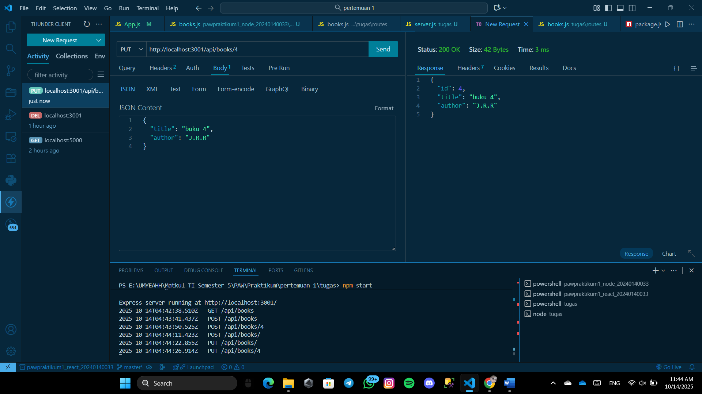
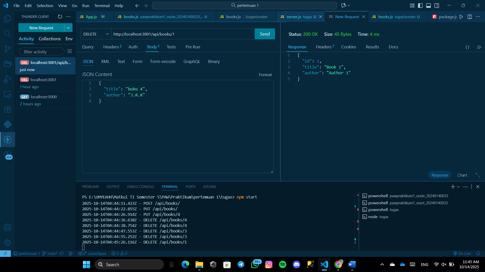

# Tugas 2
 
 Menampilkan End Point Create Book
 
 Menampilkan End Point Get All Book
 
 Menampilkan End Point Get Book By Id
 
 Menampilkan End Point Update Book By Id
 
 Menampilkan End Point Delete Book By Id
 