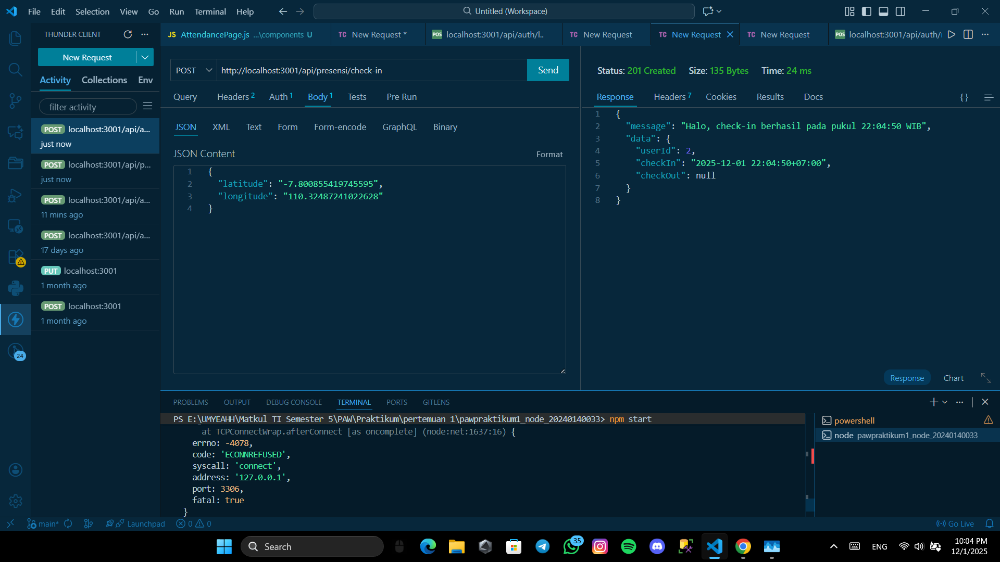
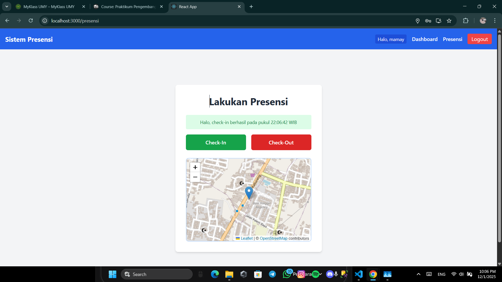
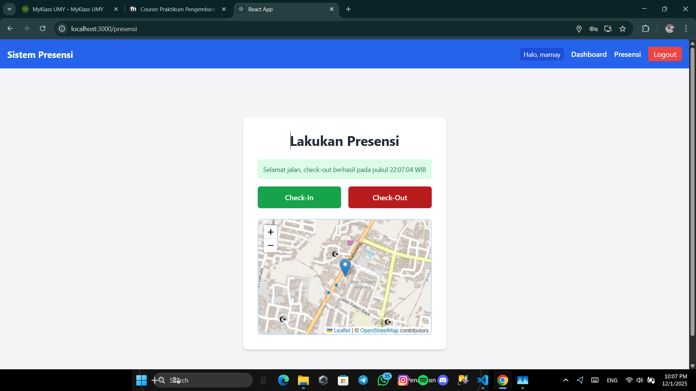
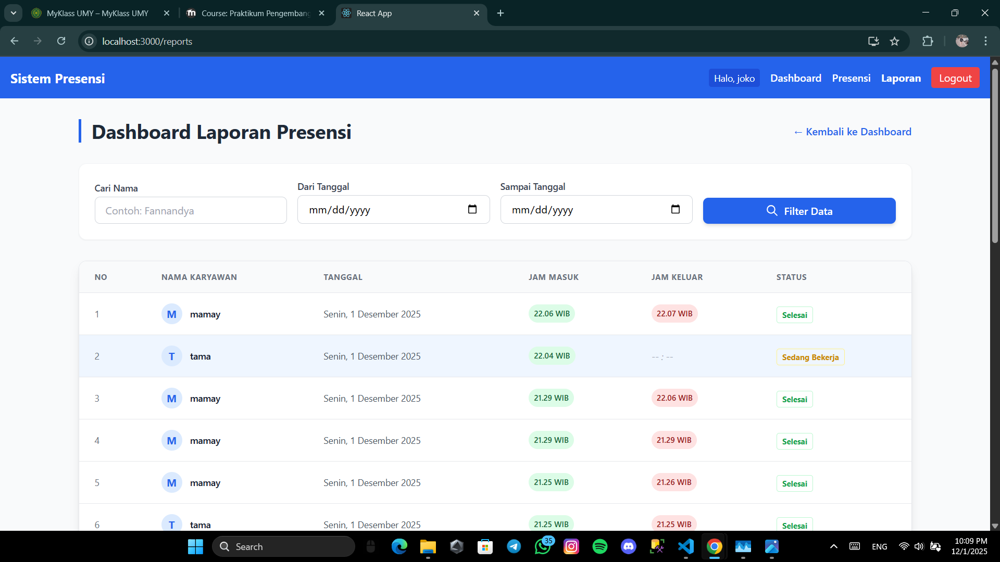
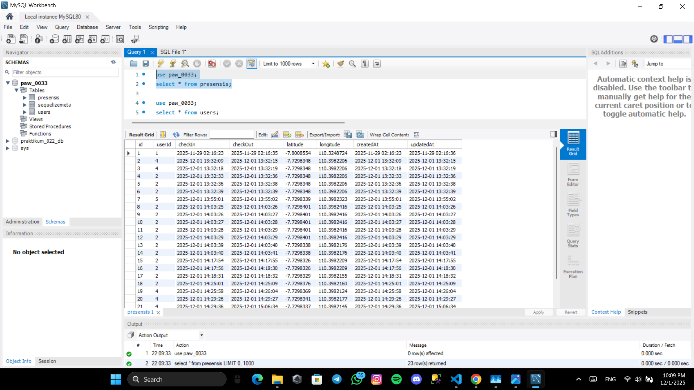

# Tugas 7
 Menampilkan Tampilan Endpoint presensi/check-in dengan menggunakan bearer token dan body latitude, longitude
 

 Menampilkan Tampilan Halaman presensi dengan menampilkan maps OSM check-in
 

 Menampilkan Tampilan Halaman presensi dengan menampilkan maps OSM check-out
 

 Menampilkan Tampilan halaman report yg berisi data presensi dari semua user
 

 Menampilkan Tampilan Screenshote tabel presensi di database
 
